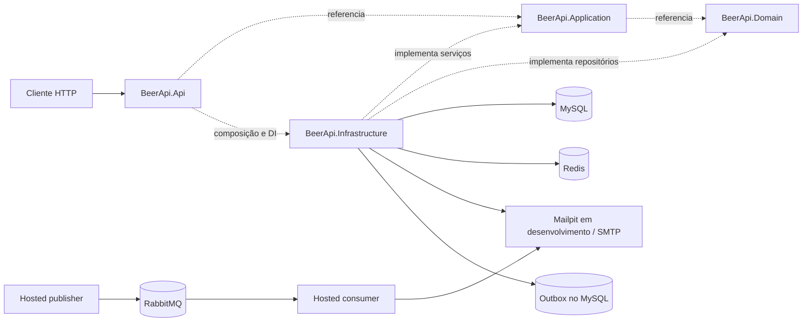
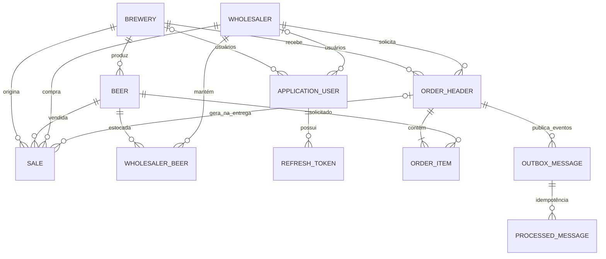
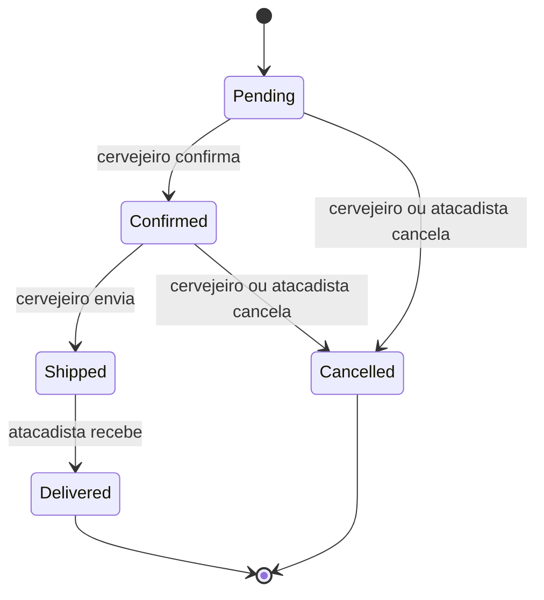
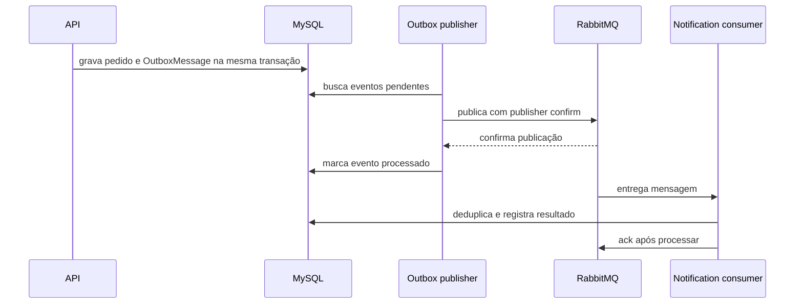

# BeerApi

API REST para gestão de cervejarias, cervejas, vendas e estoque de atacadistas. Projeto de portfólio em .NET 10 com MySQL, Redis, autenticação por bearer token e testes contra containers reais.

## Visão Geral

- Cervejeiros gerenciam as cervejas da própria cervejaria e registram vendas para atacadistas.
- Vendas atualizam o estoque e ficam disponíveis em histórico paginado.
- Usuários autenticados podem solicitar orçamentos com desconto por volume.
- Administradores consultam o log de auditoria.
- O seed inclui 7 cervejarias belgas, 16 cervejas e 3 atacadistas.

## Arquitetura









### Decisões de Arquitetura

| ADR | Decisão | Motivo e consequência |
|---|---|---|
| 001 | Separar Domain, Application, Infrastructure e API | Regras e contratos ficam independentes de EF Core e HTTP; o custo é manter interfaces nos limites entre camadas. |
| 002 | Usar access tokens opacos do ASP.NET Core Identity e refresh tokens próprios | O access token aproveita o bearer handler do framework; refresh tokens armazenam somente SHA-256, rotacionam a cada uso e a reutilização revoga a família. |
| 003 | Manter MySQL como fonte de verdade e usar HybridCache com Redis | Redis compartilha o cache entre processos e memória local reduz leituras repetidas. Tags invalidam dados após escritas; o L1 de outras instâncias pode permanecer até o TTL local de 30 segundos. |
| 004 | Executar escritas transacionais através da execution strategy do EF Core | MySQL usa retry automático; a operação inteira precisa estar dentro da estratégia para preservar consistência em retries. |
| 005 | Testar a integração com MySQL, Redis e RabbitMQ via Testcontainers | Exercita persistência, cache e mensageria reais em containers descartáveis; requer Docker durante os testes locais. |
| 006 | Modelar pedido separado de venda | O pedido mantém o fluxo Pending → Confirmed → Shipped → Delivered/Cancelled; estoque e registros de venda só mudam na entrega. |
| 007 | Usar outbox transacional com RabbitMQ | Pedido e evento gravam juntos no MySQL; publisher confirms e deduplicação no consumer dão entrega at-least-once. O publisher atual assume uma instância da API. |
| 008 | Usar paginação keyset no catálogo | Cursor estável sobre chave de ordenação e Id evita custo/instabilidade do offset; ordenação por cursor limita-se a Id, preço e teor alcoólico. |
| 009 | Proteger pedido e estoque com concorrência otimista | Escritas concorrentes retornam 409 em vez de sobrescrever o saldo. |
| 010 | Gerar CSV com a biblioteca padrão | O formatter escapa delimitadores, limita exportações a 10.000 linhas e protege células iniciadas por caracteres de fórmula sem adicionar dependência. |

### Stack

| Componente | Versão | Uso |
|---|---:|---|
| .NET / ASP.NET Core | 10 | Runtime e API REST |
| Entity Framework Core | 9.0.8 | ORM e migrations |
| Pomelo MySQL | 9.0.0 | Provider MySQL |
| MySQL | 8.0 | Persistência relacional |
| `Microsoft.Extensions.Caching.Hybrid` | 10.10.0 | Cache L1/L2, coalescência de chamadas e tags |
| `Microsoft.Extensions.Caching.StackExchangeRedis` / Redis | 10.0.11 / 7 | Cache distribuído |
| `Microsoft.AspNetCore.OpenApi` | 10.0.12 | Geração do documento OpenAPI |
| `Scalar.AspNetCore` | 2.17.11 | Interface interativa para a documentação da API |
| ASP.NET Core Identity | — | Usuários, roles e bearer authentication |
| MailKit / Mailpit | 4.18.1 / — | SMTP e caixa de e-mail local |
| RabbitMQ.Client / RabbitMQ | 7.2.2 / 4 | Publisher confirms, outbox e notificações |
| Serilog | 8.0 | Logs estruturados |
| xUnit / Testcontainers | 2.9 / 4.15 | Testes unitários e containers MySQL, Redis e RabbitMQ |
| k6 | 0.55.0 | Benchmark local de carga |

## Executar Localmente

### Pré-requisitos

- .NET 10 SDK
- Docker Desktop com Docker Compose

### Subir a aplicação em containers

```powershell
Copy-Item .env.example .env
docker compose up -d --build
docker compose ps
```

O Compose inicia MySQL, Redis, RabbitMQ, Mailpit e API. Endereços locais:

| Serviço | Endereço |
|---|---|
| API | `http://localhost:5157` |
| Health check | `http://localhost:5157/health` |
| Mailpit | `http://localhost:8025` |
| RabbitMQ Management | `http://localhost:15672` |
| Scalar | `http://localhost:5157/scalar` somente em `Development` |
| Documento OpenAPI | `http://localhost:5157/openapi/v1.json` somente em `Development` |

O container da API usa `Production`, portanto Scalar e o documento OpenAPI não são expostos por esse perfil. Para executá-los localmente em `Development`, suba apenas as dependências e rode a API com o perfil padrão do projeto:

```powershell
docker compose up -d db redis mailpit
dotnet run --project src/BeerApi.Api
```

As migrations e o seed de roles/admin são aplicados no startup. O Mailpit captura as mensagens de confirmação e recuperação de senha em `http://localhost:8025`.

### Credenciais

O admin local usa `admin@beerapi.com` / `Admin@123!` quando não há valores configurados. Altere `AdminUser__Password` antes de expor a aplicação fora da máquina local; não versione credenciais reais.

## Autenticação e Autorização

- Cadastro de cervejeiro ou atacadista cria a conta pendente e envia confirmação de e-mail.
- Login exige e-mail confirmado; access token opaco expira em 15 minutos.
- Refresh token aleatório é persistido somente como hash, expira em 14 dias e é rotacionado ao ser usado.
- Reutilizar um refresh token consumido revoga a família. Logout revoga a família atual; reset de senha revoga os refresh tokens ativos do usuário.
- Endpoints de autenticação limitam solicitações a 10 por minuto por IP; após cinco tentativas inválidas, o Identity bloqueia temporariamente o login.
- As policies separam acesso administrativo, papel Brewer e propriedade da cervejaria; um Brewer só altera cervejas e registra vendas da própria cervejaria.

## API

As listagens paginadas recebem `page` (padrão 1) e `pageSize` (padrão 20, máximo 100) e retornam `{ items, page, pageSize, totalCount, totalPages }`.

| Método | Rota | Acesso | Descrição |
|---|---|---|---|
| `POST` | `/api/auth/register/brewer` | Público | Registrar cervejeiro e cervejaria |
| `POST` | `/api/auth/register/wholesaler` | Público | Registrar atacadista |
| `GET` | `/api/auth/confirm-email?userId=&code=` | Público | Confirmar e-mail |
| `POST` | `/api/auth/resend-confirmation` | Público | Reenviar confirmação |
| `POST` | `/api/auth/login` | Público | Obter access e refresh tokens |
| `POST` | `/api/auth/refresh` | Público | Rotacionar refresh token |
| `POST` | `/api/auth/logout` | Autenticado | Revogar a família de refresh tokens |
| `POST` | `/api/auth/forgot-password` | Público | Solicitar reset; resposta não revela se a conta existe |
| `POST` | `/api/auth/reset-password` | Público | Redefinir senha |
| `GET` | `/api/auth/me` | Autenticado | Consultar usuário e claims |
| `GET` | `/api/breweries` | Autenticado | Listar cervejarias |
| `GET` | `/api/breweries/{id}` | Autenticado | Consultar cervejaria |
| `GET` | `/api/breweries/{breweryId}/beers` | Autenticado | Listar cervejas da cervejaria |
| `GET` | `/api/beers` | Autenticado | Busca global com `q`, `breweryId`, `style`, `minAbv`, `maxAbv`, `minPrice`, `maxPrice`, `sortBy`, `sortDir` e paginação offset |
| `GET` | `/api/beers/cursor` | Autenticado | Mesmos filtros, paginação keyset; `sortBy` aceita `id`, `price` ou `abv` |
| `POST` | `/api/breweries/{breweryId}/beers` | Brewer proprietário / Admin | Criar cerveja |
| `PUT` | `/api/breweries/{breweryId}/beers/{beerId}` | Brewer proprietário / Admin | Atualizar cerveja |
| `DELETE` | `/api/breweries/{breweryId}/beers/{beerId}` | Brewer proprietário / Admin | Excluir cerveja |
| `GET` | `/api/wholesalers` | Autenticado | Listar atacadistas |
| `GET` | `/api/wholesalers/{id}/beers` | Autenticado | Consultar estoque |
| `POST` | `/api/wholesalers/{id}/quote` | Autenticado | Calcular orçamento |
| `POST` | `/api/wholesalers/{id}/beers/{beerId}/stock-out` | Atacadista proprietário / Admin | Registrar saída; cria alerta ao cruzar o limite de estoque |
| `POST` | `/api/orders` | Atacadista / Admin | Criar pedido de várias cervejas da mesma cervejaria |
| `GET` | `/api/orders` | Brewer / Wholesaler / Admin | Listar pedidos paginados, com filtro `status` e escopo por usuário |
| `GET` | `/api/orders/{id}` | Participante do pedido / Admin | Consultar pedido e itens |
| `POST` | `/api/orders/{id}/confirm` | Cervejeiro proprietário / Admin | Confirmar pedido |
| `POST` | `/api/orders/{id}/ship` | Cervejeiro proprietário / Admin | Enviar pedido confirmado |
| `POST` | `/api/orders/{id}/deliver` | Atacadista proprietário / Admin | Entregar, incrementar estoque e criar vendas |
| `POST` | `/api/orders/{id}/cancel` | Participante do pedido / Admin | Cancelar enquanto Pending ou Confirmed |
| `POST` | `/api/sales` | Brewer proprietário / Admin | Registrar venda |
| `GET` | `/api/sales` | Brewer / Admin | Listar vendas; Brewer vê apenas as próprias |
| `GET` | `/api/audit-logs` | Admin | Consultar auditoria com filtro opcional `entityName` |
| `GET` | `/api/reports/sales` | Brewer proprietário / Admin | Receita e quantidade por dia ou mês; JSON/CSV |
| `GET` | `/api/reports/top-beers` | Brewer proprietário / Admin | Cervejas mais vendidas; JSON/CSV |
| `GET` | `/api/reports/stock` | Atacadista proprietário / Admin | Estoque completo ou abaixo do limite; JSON/CSV |
| `GET` | `/api/reports/orders-by-status` | Participante / Admin | Contagem por status com escopo do usuário; JSON/CSV |
| `GET` | `/health` | Público | Verificar MySQL/Redis; RabbitMQ indisponível degrada o status e mantém eventos no outbox |

## Regras de Negócio e Auditoria

- Registrar uma venda incrementa o estoque do atacadista; se não houver entrada de estoque, ela é criada.
- Um pedido contém de 1 a 50 cervejas da mesma cervejaria. A criação congela preço e desconto; só a entrega cria uma venda por item e incrementa estoque.
- O fluxo é `Pending → Confirmed → Shipped → Delivered`; `Pending` e `Confirmed` podem ser cancelados. Transições inválidas e atualizações concorrentes retornam `409`.
- A saída de estoque não pode exceder o saldo. Ao cruzar `Stock__LowThreshold` (padrão 10), o sistema grava um evento de alerta.
- Pedido/estoque e `OutboxMessage` são persistidos na mesma transação. O publisher usa confirmação do RabbitMQ; consumidores deduplicam por `MessageId` e encaminham falhas após 3 tentativas para a DLQ.
- A garantia de mensageria é at-least-once; o consumer é idempotente. O publisher em lote pressupõe uma instância ativa; para escalar horizontalmente, a próxima etapa é reivindicar linhas com locking (`SKIP LOCKED`).
- `OrderPlaced` avisa a cervejaria; mudanças de status avisam o atacadista; cruzar o limite de estoque envia alerta ao atacadista via Mailpit/SMTP.
- Orçamentos aplicam 0% até 10 unidades, 10% acima de 10 e 20% acima de 20.
- O imposto atual é 0% (`TaxRate` fica registrado na venda).
- Alterações de domínio são gravadas em `AuditLogs` com entidade, ação, valores anteriores/novos, instante UTC e usuário quando disponível. Refresh tokens são excluídos da auditoria.

## Cache e Benchmark

O cache está aplicado aos DTOs de cervejarias, cervejas e atacadistas/estoque. Escritas, entrega de pedido e saída de estoque invalidam as tags afetadas; pedidos, cotações, relatórios, vendas paginadas e auditoria não são cacheados. No padrão atual, a expiração L2 é 300 segundos e a L1 local é 30 segundos. `CACHE_ENABLED=false` desliga os decorators para comparação; em múltiplas instâncias, os L1s remotos podem permanecer até expirar.

O cenário k6 executa 20 VUs por 60 segundos. Uma comparação local produziu:

| Cache | Requisições/s | Mediana | p95 | Falhas HTTP |
|---|---:|---:|---:|---:|
| Desligado | 98,34 | 4,00 ms | 20,92 ms | 0% |
| Ligado | 97,12 | 2,25 ms | 32,76 ms | 0% |

Nesta amostra, a mediana caiu com cache, mas o p95 não melhorou e a vazão ficou praticamente igual. É uma medição local, não uma garantia de performance em produção.

Relatórios aceitam `format=json|csv`. CSV usa UTF-8, protege contra formula injection e limita a exportação a 10.000 linhas. Vendas/top beers aceitam `from`/`to` UTC; o período máximo é 366 dias.

Para repetir no PowerShell com a API e os serviços do Compose em execução:

```powershell
$env:CACHE_ENABLED = "false"
docker compose up -d --force-recreate api
docker compose --profile loadtest run --rm --no-deps k6

$env:CACHE_ENABLED = "true"
docker compose up -d --force-recreate api
docker compose --profile loadtest run --rm --no-deps k6
Remove-Item Env:CACHE_ENABLED
```

## Testes e CI

```powershell
dotnet test BeerApi.slnx
dotnet test tests/BeerApi.UnitTests
dotnet test tests/BeerApi.IntegrationTests
```

Os testes de integração usam `WebApplicationFactory` e containers descartáveis de MySQL, Redis e RabbitMQ via Testcontainers; Docker precisa estar ativo. O GitHub Actions restaura e compila a solução, depois executa as duas suítes em cada pull request para `main`, conforme [ci.yml](.github/workflows/ci.yml).

## Configuração

Copie `.env.example` para `.env`. Compose fornece valores locais padrão; configure segredos próprios antes de publicar a API.

| Variável/configuração | Uso |
|---|---|
| `MYSQL_ROOT_PASSWORD`, `MYSQL_DATABASE`, `MYSQL_USER`, `MYSQL_PASSWORD`, `DB_PORT` | Inicialização e porta publicada do MySQL |
| `REDIS_PORT`, `REDIS_CONNECTION` | Redis local; dentro do Compose a API usa `redis:6379` |
| `CACHE_ENABLED` | Ativar/desativar decorators de cache no Compose |
| `RABBITMQ_USER`, `RABBITMQ_PASSWORD` | Credenciais do broker; use uma senha própria fora do ambiente local |
| `RABBITMQ_PORT`, `RABBITMQ_MANAGEMENT_PORT` | Portas AMQP e painel de gerenciamento |
| `STOCK_LOW_THRESHOLD` | Limite global para alertas de estoque baixo (padrão 10) |
| `AdminUser__Email`, `AdminUser__Password` | Conta admin inicial |
| `APP_PUBLIC_BASE_URL` | Base dos links de confirmação/reset enviados por e-mail |
| `Auth__AccessTokenMinutes`, `Auth__RefreshTokenDays` | Prazos dos tokens; padrões 15 min / 14 dias |
| `Cache__ExpirationSeconds`, `Cache__LocalExpirationSeconds` | TTL L2/L1; padrões 300 s / 30 s |
| `AllowedOrigins` | Origens CORS; em desenvolvimento, localhost:3000 e localhost:5173 |

O Compose direciona SMTP ao Mailpit. Para usar outro provedor no Compose, altere o mapeamento SMTP do serviço `api`; fora do Compose, configure `Smtp__Host`, `Smtp__Port`, `Smtp__Username`, `Smtp__Password` e `Smtp__UseStartTls` no ambiente de execução. As variáveis `RABBITMQ_*` configuram o broker no Compose; a API lê `RabbitMQ__Host`, `RabbitMQ__Port`, `RabbitMQ__Username`, `RabbitMQ__Password` e `RabbitMQ__VirtualHost`.

## Insomnia e Migrations

Importe [BeerApi_Insomnia.json](BeerApi_Insomnia.json) no Insomnia para testar os endpoints. Para adicionar uma migration:

```powershell
dotnet ef migrations add NomeDaMigration `
  --project src/BeerApi.Infrastructure `
  --startup-project src/BeerApi.Api `
  --output-dir Data/Migrations
```